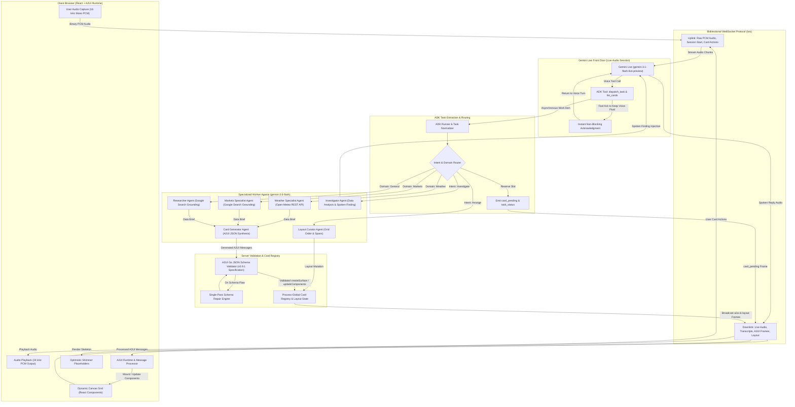
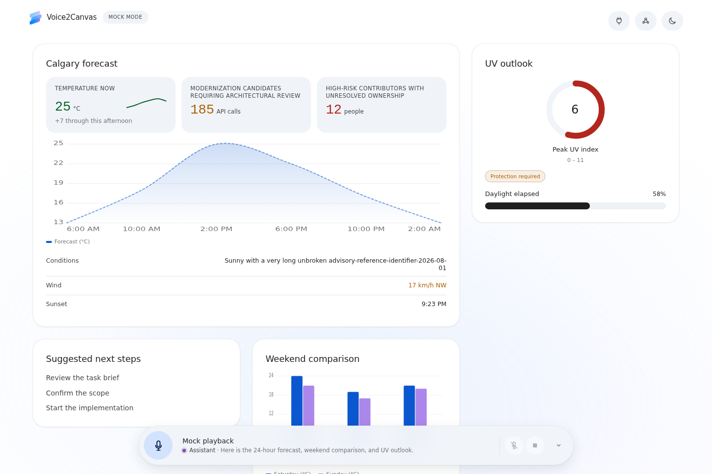
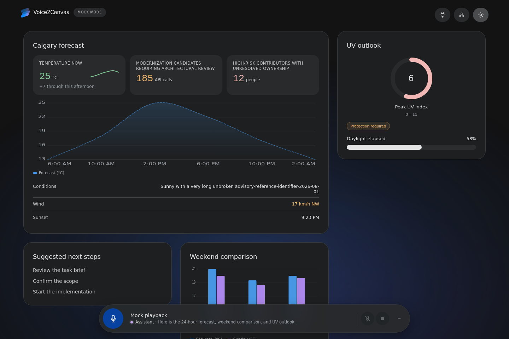
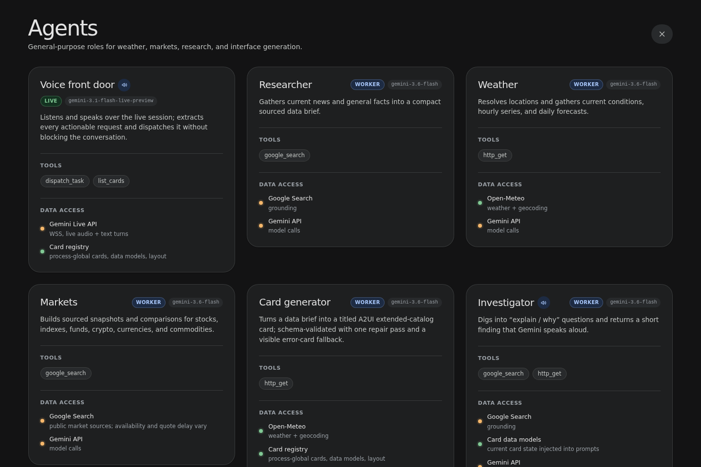
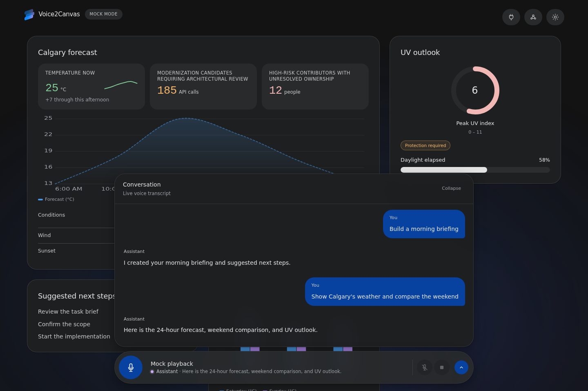
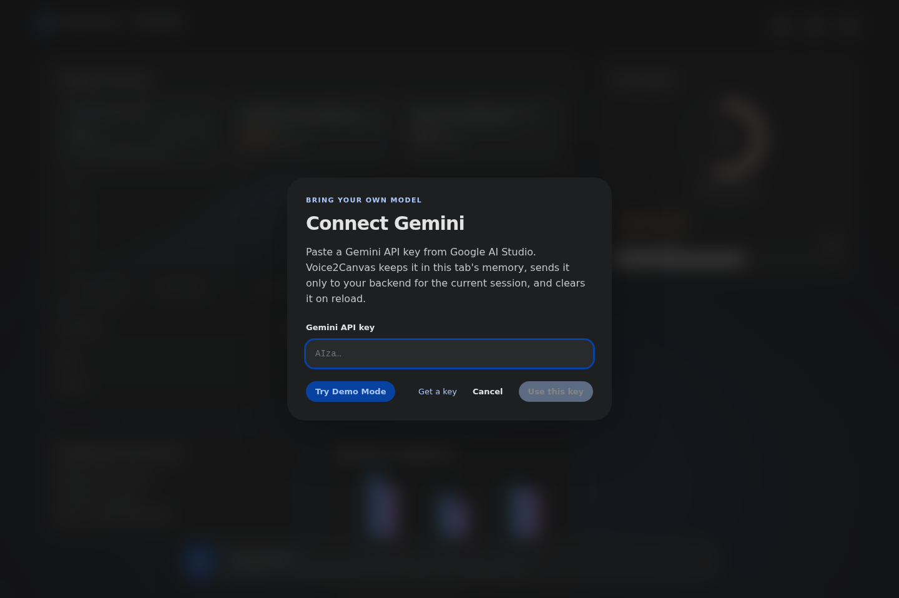

# Voice2Canvas

Voice2Canvas is an open reference implementation of V2UI, the voice-to-UI framework described in the paper [When voice builds the interface](https://anvilpalamattam.com/papers/when-voice-builds-the-interface/): turning a live voice conversation into a dynamic interface. A user speaks to Gemini Live, an ADK agent converts the request into bounded tasks, and those tasks generate validated A2UI cards on a responsive canvas.

Voice2Canvas provides a clean, modular voice-to-interface pipeline with explicit local setup, configuration, and bring-your-own-key testing.

---

## System Architecture

Voice2Canvas decouples conversational voice interaction from background UI synthesis. The live voice loop stays responsive while specialized background agents autonomously research data, generate declarative A2UI components, validate schemas, and stream updates directly to the client canvas.



### Architectural Pipeline Breakdown

1. **User Audio Capture & Streaming**: The browser captures 16-bit little-endian PCM audio at 16 kHz mono through the Web Audio API and streams binary frames over a full-duplex WebSocket connection. Real-time client-side audio playback buffers 24 kHz audio returned from the model, supporting instant interruption and barge-in handling.
2. **Gemini Live Front Door**: The Go server relays audio into a bidirectional Gemini Live session (`gemini-3.1-flash-live-preview`). The live front door converses naturally and detects interface intents, executing ADK tool calls (`dispatch_task`, `list_cards`).
3. **ADK Task Extraction & Fast Acknowledgment**: When a user asks to view or change data, `dispatch_task` records the intent (`create`, `update`, `remove`, `investigate`, `arrange`), target domain (`weather`, `markets`, `general`), and optional refresh intervals. The tool returns an immediate acknowledgment back to Gemini Live before generation starts so voice synthesis is never blocked by downstream generation. Concurrently, the server emits `card_pending` and `task_status` frames to render responsive loading shimmers on the canvas.
4. **Specialized Worker Agents & Card Generation**: Background tasks execute asynchronously via Google ADK v2 runners using `gemini-3.6-flash`:
   - **Weather Specialist**: Resolves geocoordinates and fetches live conditions, hourly curves, and weekly forecasts via Open-Meteo.
   - **Markets Specialist**: Fetches real-time price quotes, intraday movements, and market benchmarks via Google Search grounding.
   - **Researcher Agent**: Synthesizes sourced background summaries and news briefs with Google Search grounding.
   - **Investigator Agent**: Cross-examines existing card models and injects analytical findings directly back into the live voice session to be spoken aloud.
   - **Layout Curator**: Re-orders cards and assigns 1-column or 2-column grid spans based on conversational priority.
   - **Card Generator**: Assembles structured research briefs into declarative A2UI JSON specifications.
5. **A2UI Go JSON Schema Validator**: Every generated payload (`createSurface`, `updateComponents`, `updateDataModel`) is strictly checked against the A2UI v0.9.1 schema and extended catalog definitions using a Go JSON Schema validator. If minor validation flaws occur, a single-pass repair pass corrects them before committing to the server registry. Malformed payloads are intercepted before reaching the client.
6. **Client A2UI Runtime & Dynamic Canvas**: Validated messages arrive at the frontend A2UI runtime, which resolves component hierarchies and renders rich interactive React cards—including KPI stat badges, time-series charts, radial gauges, tabular data, and action triggers.

---

## Visual Walkthrough & Interface Tour

### Dynamic Canvas (Light Theme)



*The Voice2Canvas dynamic canvas in light theme displaying live-generated A2UI cards across a responsive grid layout. Cards feature real-time multi-day weather forecasts with hourly temperature curves, financial market summaries with color-coded trend indicators, radial gauge metrics, and interactive action buttons. The top navigation bar provides quick access to the agent roster, connection status, audio controls, and the live conversation drawer.*

---

### Dynamic Canvas (Dark Theme)



*The Voice2Canvas canvas rendered in high-contrast dark theme. The extended A2UI component catalog adapts seamlessly to dark mode, rendering crisp SVG charts, gauge progress rings, stat callouts, and structured key-value tables. The responsive CSS grid dynamically rearranges single-span and double-span cards as directed by the layout curator agent.*

---

### Specialized Agent Architecture & Roster Modal



*The built-in Agent Roster inspector modal detailing the multi-agent topology. It enumerates the active agents (Voice Front Door, Researcher, Weather Specialist, Markets Specialist, Card Generator, Investigator, Layout Curator, and Auto-Refresh), their assigned models (`gemini-3.1-flash-live-preview` vs. `gemini-3.6-flash`), registered tools (`google_search`, Open-Meteo `http_get`, `dispatch_task`), and live data source connectivity.*

---

### Live Voice Conversation & Transcript Drawer



*The slide-out conversation drawer displaying synchronized, real-time transcriptions. Users can follow live speech input (`input_transcript`) and Gemini Live's spoken responses (`output_transcript`) alongside task dispatch audit events (`dispatched`, `researching`, `generating`, `rendered`). This provides full visibility into how spoken utterances map to autonomous agent tasks and canvas updates.*

---

### Bring Your Own Key & Interactive Demo Dialog



*The client-side Bring Your Own Key (BYOK) connection modal. For local exploration and self-hosted environments, users can enter a Gemini API key that is held ephemerally in tab memory and transmitted solely over the secure WebSocket session start handshake. The modal also provides single-click access to a deterministic mock mode (`?mock=1`) that allows exploring the full UI canvas without API credentials.*

---

## What it demonstrates

- **Full-Duplex Browser Audio over WebSocket**: 16 kHz PCM microphone capture upstream, 24 kHz voice synthesis downstream, with automatic interruption and barge-in handling.
- **Fast Task Acknowledgment with Concurrent Generation**: Voice interaction never waits on background research or card rendering; dispatch tools acknowledge instantly.
- **Multi-Agent Orchestration with ADK v2**: Decoupled specialist agents for weather, public markets, general research, and layout curation.
- **Strict Schema Validation & Auto-Repair**: Go server validates every A2UI message against the v0.9.1 JSON schema, running automated repair passes on syntax deviations.
- **Extended Component Catalog**: Rich visual primitives including Stat (KPIs), Chart (line/bar/area), Gauge (radial gauges), Progress, Key/Value pairs, Badges, and Data Tables.
- **Process-Global Card Registry & State Replay**: Server retains current canvas state and card models, enabling instant state restoration on browser page reloads.
- **Flexible Ephemeral Authentication**: Per-session browser-provided Gemini API keys, server-side environment variables, Vertex AI ADC credentials, or keyless deterministic mock mode (`?mock=1`).

---

## API Prerequisites

Voice2Canvas uses Gemini Live (`gemini-3.1-flash-live-preview`) for bidirectional voice communication and `gemini-3.6-flash` for A2UI card generation.

- **Get an API Key**: Obtain a Gemini API key from [Google AI Studio](https://aistudio.google.com/app/apikey).
- **Model Access**: Ensure your account has access to Gemini Live models.
- **Google Cloud / Vertex AI (Alternative)**: Vertex AI Application Default Credentials (ADC) are also supported with `GOOGLE_CLOUD_PROJECT` and `GOOGLE_CLOUD_LOCATION`.

---

## Quick start

Prerequisites: Go 1.26, Node 22, and a Gemini API key or the `?mock=1` keyless mode.

### Terminal 1: Frontend

```sh
cd voice2canvas/frontend
npm ci
npm run dev
```

### Terminal 2: Backend

```sh
cd voice2canvas/backend
go run ./cmd/server
```

Open <https://localhost:5173> (or `https://<lan-ip>:5173` from another device on your local network). The Vite dev server runs over HTTPS by default to satisfy browser secure context requirements for microphone capture on LAN devices without needing Chrome flags. On the first visit to the LAN IP, browsers display a self-signed certificate warning: click "Advanced" -> "Proceed to <ip> (unsafe)", after which the browser treats the origin as secure and prompts for normal microphone permissions. HTTPS can be disabled if needed by setting `HTTPS=false`, `VOICE2CANVAS_HTTPS=0`, or `V2UI_HTTPS=0`.

Click the connect icon in the top-right corner to add a Gemini API key, or press the microphone and Voice2Canvas will ask for one when the server has no credentials. The key stays in the current tab's memory and is sent in the WebSocket `start` frame; it is not saved to browser storage.

To explore the UI without Gemini, open <https://localhost:5173/?mock=1>.

### Server-managed authentication

For a shared development server, set `GEMINI_API_KEY` before starting the Go backend:

```sh
cd voice2canvas/backend
GEMINI_API_KEY=... go run ./cmd/server
```

When both are present, a browser-provided key applies only to that WebSocket session and takes precedence over server credentials.

---

## Repository layout

- `frontend/` — React, Vite, audio capture/playback, A2UI renderer, and dynamic canvas
- `backend/` — Go HTTP/WebSocket server, Gemini Live session, ADK specialists for weather, markets, research, and Go JSON schema validation
- `catalog/` — Portable extended A2UI catalog contracts and schemas
- `deploy/` — Example systemd units and install script for single-host Linux deployment
- `PROTOCOL.md` — Browser/server WebSocket wire protocol specification
- `docs/` — Operations, deployment documentation, and interface screenshots
- `docs/screenshots/` — High-resolution interface captures of the canvas, agent roster, transcript drawer, and BYOK modal

---

## Verify

Run the full automated test suite and typecheck across both frontend and backend:

```sh
cd voice2canvas/frontend && npm ci && npm test && npm run typecheck && npm run build
cd ../backend && go test ./... && go vet ./... && go build ./cmd/server
```

CI checks run the monorepo workflows at `.github/workflows/voice2canvas-ci.yml` and `.github/workflows/voice2canvas-docker.yml`.

---

## Security

The browser-key flow is designed for a local demo you run yourself. A deployed backend necessarily receives the key and could observe it, so do not paste a key into an instance operated by someone you do not trust. See [`SECURITY.md`](SECURITY.md) for the threat model and deployment guidance.

---

## Status

Voice2Canvas is an experimental reference project, not a hosted service or stable SDK. The protocol and extended catalog are expected to evolve. The `deploy/` directory holds example systemd units and an install script for self-hosting on one Linux box; there is no hosted service.

---

## License

Apache-2.0 — see [`LICENSE`](LICENSE).

---

## Disclaimer

This is a personal project. The views, code, and opinions expressed here are my own and do not represent those of my current or past employers.
